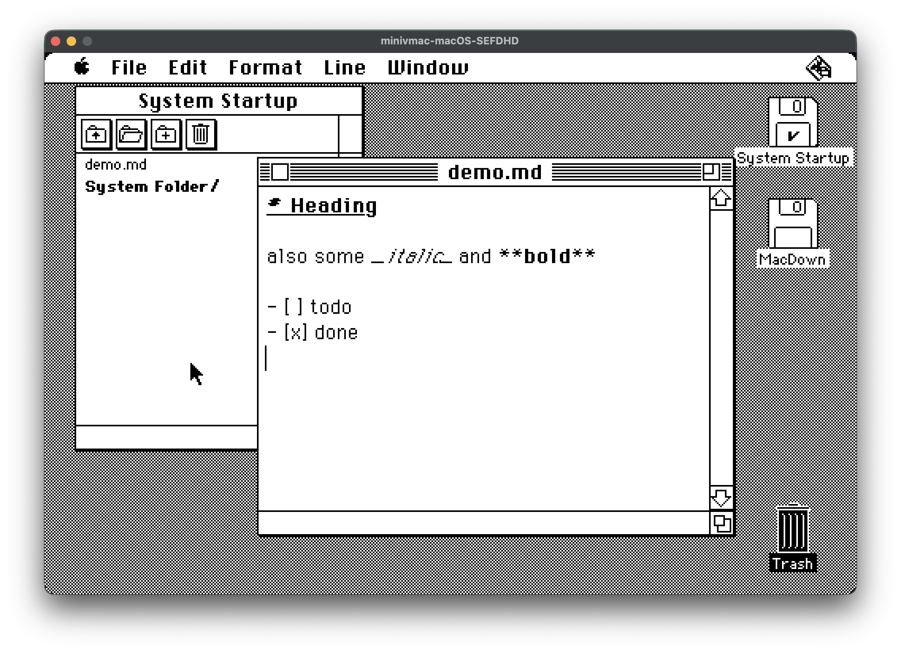

# MacDown

A Markdown editor for the not-so-modern age. Built for Macintosh OS System 6 and 7.



It's based on the [VibeRetro68](https://github.com/erikbuild/VibeRetro68) template project.

## Download

Precompiled packages in various formats are available from [the releases page](https://github.com/schrockwell/MacDown/releases).

## Features

- Markdown-aware editing of headings, bold/italic, lists, blockquote, etc
- Auto todo list toggle for GitHub-style tasks like `- [ ] todo`
- Multi-document support
- Integrated file browser for easy navigation between files
- Modern keyboard shortcuts for text and window manipulation

## Development

This section is a summary. See [the template README](https://github.com/erikbuild/VibeRetro68) for more details.

### Initial Setup

This will fetch and install all necessary build dependencies on modern macOS.

```sh
make setup
```

### Test on System 6

```sh
make minivmac
```

### Test on System 7

```sh
make basiliskii
```